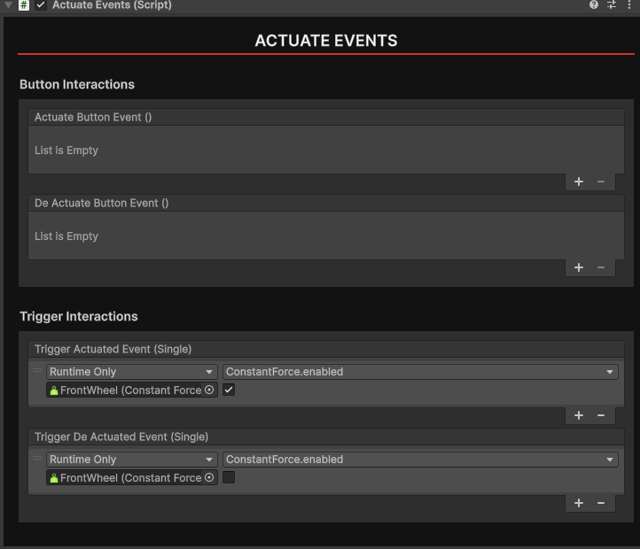

# Actuate Events

The `Actuate Events` component allows you to create simple logic involving the controller triggers and buttons. The events are synced across all clients, similar to grip events.

## Button Interactions

These events are fired when the user presses or depresses the top button on their controller. 

## Trigger Interactions

These events are fired when the user pulls or releases the trigger of their controller. A float value for the trigger is passed through here.