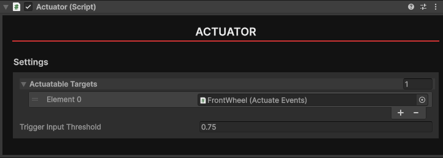

# Actuator

The `Actuator` is used to send trigger and button inputs to various components, such as guns. 

## Usage

An Actuator must be placed on the same GameObject as a `grip` to work properly. The Actuator will be linked to that grip in-game. You can then assign a Actuatable Targets to the Actuator. Current targets include:

- Actuate Events
- Gun Receiever

Additionally you can change the percentage of how far the trigger has to be held to invoke the actuator using the `Trigger Input Threshold` field. For example, a value of 0.75 will require the trigger to be held 3/4 of the down, while a value of 0.25 will require the trigger to be held slightly down.

