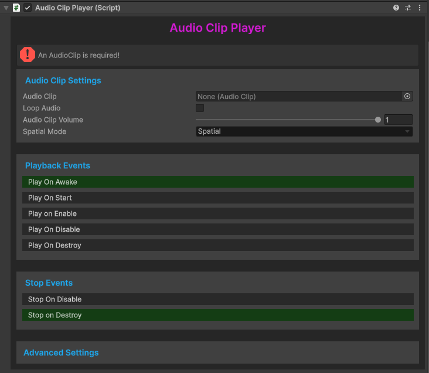
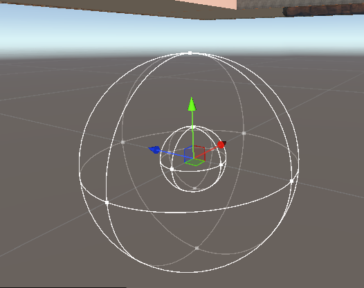
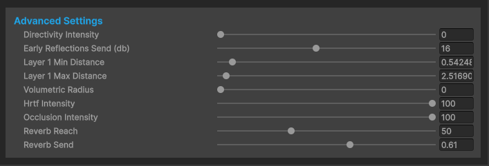

# Audio Clip Player

The Audio Clip Player provides an easy way to play audio in scenes or on prefabs, without having to interact with our audio middleware. Sounds played with the Audio Clip Player will be properly spatialized as well. 

## Audio Clip Settings

### Audio Clip

To begin, assign an audioclip into the `Audio Clip` field. For parity with the default NervBox sounds, and for storage space considerations, we recommend your audio file be limited at a True Peak of -3db, and you use an Ogg Vorbis file at a compression ratio of 30%. 

### Loop Audio

Enabling the `Loop Audio` option will make your sound repeat until it is explicitly stopped. See Stop Events below for details. When enabling Loop Audio, Nervware automatically applies an 80ms fade in and fadeout. This is to prevent audio artifacts when starting and stopping events. We recommend one of two ways to process your audio clip for looping before adding to the Audio Clip field:

1. Ensure your audio has silence at the beginning and end of your file.  This is useful for applications such as a single song that will repeat.
2. Build your tail into the end of your audio. Simply put, render your audio, but in your DAW, allow a long tail past the point where you want your audio to end. Take the rendered file and cut where the audio should loop. Take the cut off tail and mix it into the beginning.

### Spatial Mode
The `Spatial Mode` dropdown allows you to choose whether the clip will play in world-space (Spatial), or directly through your headset's speakers (Ambient).

## Playback Events

Each playback event toggle will choose when the sound gets played. This is useful for hooking into events, playing sounds when an object spawns, playing sounds when an object despawns, and more. See the [Unity execution order documentation](https://docs.unity3d.com/6000.2/Documentation/Manual/execution-order.html) if you are unfamiliar with how Unity's event lifecylce works.

`Play On Awake` or `Play On Start` are good default values.

There is also a Play() method exposed, which can be called by events or animations.

## Stop Events

Similar to playback events, stop events will stop at different points in the objects lifecycle. It is recommended to keep `Stop On Destroy` toggled. 

## Setting Min and Max Distances

To set the attenuation distances for the sounds, use the gizmo in the scene view. The inner sphere is the minimum distance, the outer sphere is the maximum distance.

## Advanced Usage

### Directivity Intensity

Directivity Intensity determines how “directed” the sound is. Imagine cupping your hands in front of your mouth and shouting. The listener behind you will hear the sound quieter than a listener in front of you at the same distance.

### Early Reflections Send

Early Reflections Send is a decibel value of how loud the early reflections are.

### Layer 1 Min/Max Distance

The Layer 1 Min and Max distances determine the distance attenuation of the played audio, determined in meters. Your Min distance determines how far away your sound should be at its loudest. Your Max distance will be the point where your sound will have completely faded away. NOTE: Your Min distance MUST be lower than your Max distance or unexpected behavior will occur.

### Volumetric Radius

Volumetric Radius will specify that a sound should originate from an area, rather than a single point. This is useful for louder sounds such as an explosion or a large object being dropped. Volumetric Radius is determined in meters.

### HRTF Intensity

HRTF Intensity determines the amount of Head Related Transfer Function filtering to apply to your sound.  We recommend you leave this at 100.

### Occlusion Intensity

Occlusion Intensity determines the strength of the occlusion of the sound when obscured by an object. At a value of 0, there is no effect. At a value of 100, the sound will be completely silent when the source is not visible.

### Reverb Reach

Reverb Reach is a percentage value that determines the distance reverb travels in a ratio to the previously provided Max Distance. For instance, a Reverb Reach value of 50 will travel 250 meters if a Layer Max 1 Value is 500.

### Reverb Send
Reverb Send is a decibel value of how much reverb is sent to the reverb bus.