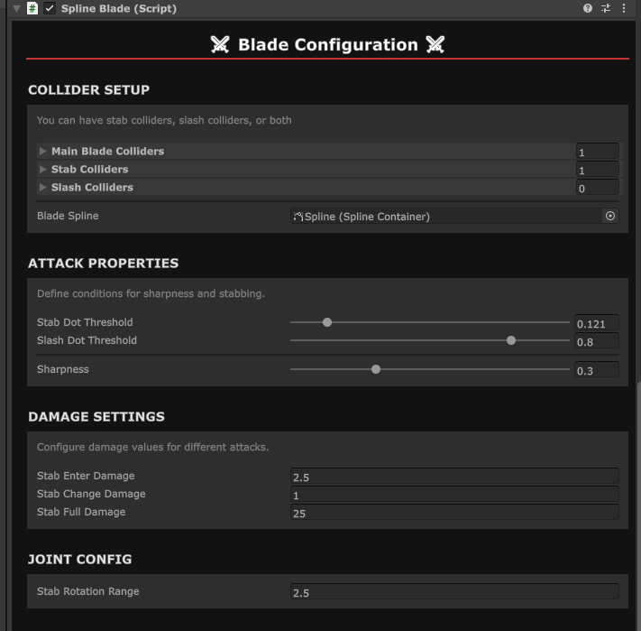
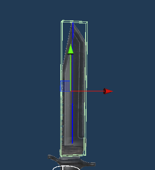
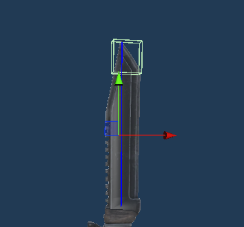
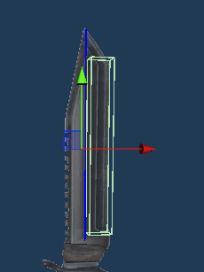
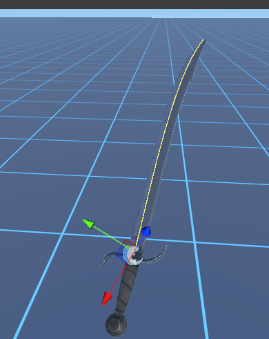

# Blades

Currently the SDK supports two types of blades, linear and spline-based. Setup for the two are essentially identical, with the main difference being the way you setup the profile of the blade.

## Collider Setup

These colliders should **NOT** be triggers.

### Main Blade Colliders

These colliders define the actualy blade object. On a knife for example, this would be the colliders that takes place along the entire blade.

### Stab Colliders

These colliders define the stab points of the blade. When stabbing an object, if this collider makes contact, a stab joint will be made.

### Slash Colliders

These colliders define the slash points of the blade. When hitting an object from the side, a stab joint will be made at this collider.

## Attack Properties

- Stab Dot Threshold: How closely the blade needs to align with an object's stab point. Lower values will allow more range of stabbing. A value of .125 is a good starter.
- Slash Dot Threshold: How closely the blade needs to be perpendicular with an object to initiate a slash. Higher values will allow for easier slashing. A value of 0.8 is a good starter.
- Sharpness: How easily the blade can pass through objects. Higher sharpness means less friction.

## Damage Settings

- Stab Enter Damage: How much damage gets applied to the target upon being stabbed.
- Stab Change Damage: How much damage gets applied to the target when the blade depth changes.
- Stab Full Damage: How much damage gets applied when the blade has been fully stabbed into the target.

## Joint Config

- Stab Rotation Range: How much rotational freedom (in degrees) is allowed when the joint has stabbed the target. Keep this value low.

## Linear Blade Setup

You'll want to assign two transforms, one at the base of the blade (Blade Base), and one at the tip (Blade Tip). This will define your blade length. Keep your blade tip and base contained within the blade, moving the base further up if you encounter issues with length.

## Spline Setup

Please note that spline blades are still experimental and may have some issues with extremely curved blades. To setup a spline blade, use the `Create Spline` button in your editor toolbar. Make this newly created spline container a child of your blade. Use the Spline Edit Mode to align your spline to your blade, ensuring that it is centered in all directions. Assign the spline containter to the blade component. 

