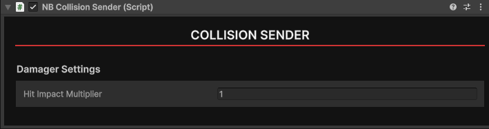

# NB Collision Sender
If you want you object to deal damage when hitting an enemy or player, add a NB Collision Sender component. Within the component set your hit impact multiplier to determine how strong your object is. Typically a value between 0.5 to 5 is good.

