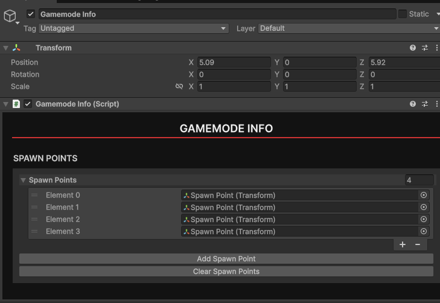
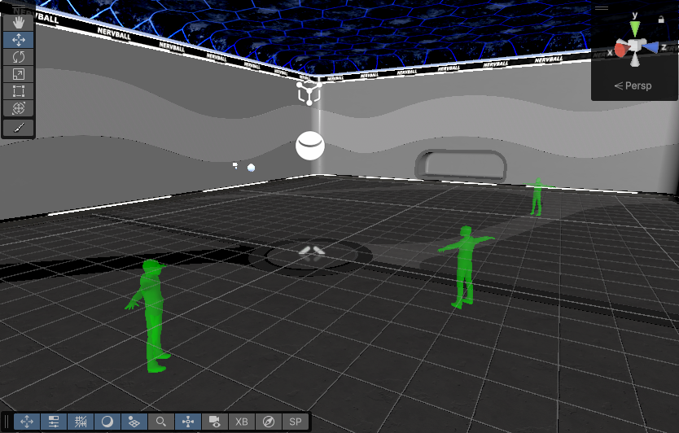

# Gamemode Info
In order for players to:
- Spawn in
- Choose a game mode
- Have game mode specific items

You'll need to provide the level with `Gamemode Info`. To do this, Create an empty game object, name it whatever you'd like, and add a `Gamemode Info` component to it. 

Within Gamemode Info, click the `Add Spawn Point` button. A representation of the player will appear in the world. Use the handle to place your spawn point. You can add as many spawn points as you'd like. In-game they will be randomly selected from. 

Your Gamemode Info is now setup.