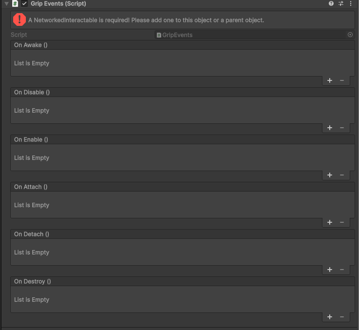
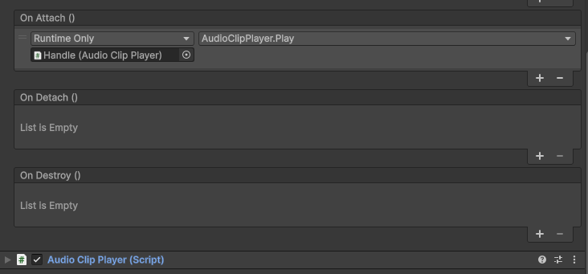

# Grip Events

The `Grip Events` component allows some basic logic involving grips. The component will track whatever grip it is attached to. A `NetworkedInteractable` is required in the parent, either on the parent rigidbody of the grip, or on the scene object itself. This is to ensure it is networked properly. All events are synced.

## Main Events
The events follow Unity's lifecycle of events, see the [Unity execution order documentation](https://docs.unity3d.com/6000.2/Documentation/Manual/execution-order.html) if you are unfamiliar. The grip that is invoking these events is registered in `OnEnable` and `OnDisable`, and found in `OnAwake`.

## Attach and Detach Events

`OnAttach` and `OnDetach` will be called when the local player grabs or releases the grip. This will be then be replicated for the other players in the game. 

## Example

In this example, the handle grip is used to play a sound via the [audio clip player](/audioclip_player.md) when grabbed. 

