# Grips Overview

Grips in NervBox are very useful for creating detailed interactable props. Grips are a bit complicated and may change in the future. As such, be prepared to have to re-upload your mods with grips.

Currently we offer 4 grip types:
- Point Grip: A grip that is set at a fixed position and rotation. For example, the trigger grip of a pistol. These grips can be flipped along different axis's if necessary. It is recommended to use a handpose with these.
- Generic Grip: A grip that can be grabbed from anywhere, with procedural posing. Generic grips can be on individual colliders or on the root of objects, allowing the objects to be grabbed from any position or rotation. When the player hand searches for grips, these grips are scored lower than all of the other grips. For example, if a point grip was in the same place as a generic grip, the point grip would be prioritized.
- Cylinder Grip: A grip that can be grabbed anywhere along a line. The rotation of the hand is constrained to be parallel with the line. An example usage of this grip would be the handle of a sword. A handpose is also recommended with these.
- Sphere Grip: A grip that represents a sphere. The hand is rotated and positioned relative to the center of the sphere. An example usage of this grip would be a basketball.
Shown below is the generic grip component.

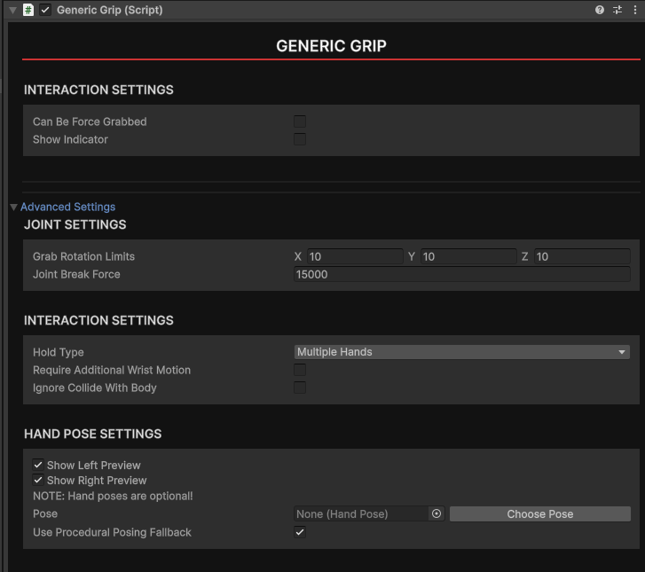

**Generally a grip will need a collider or trigger in order to be detected. The collider should be on the same object as the grip component!**

If there are any additional grip types that you feel would be beneficial to NervBox, please contact the team!

## Properties of all Grips

All grips share several fields. Some of these may be under the `Advanced Settings` foldout. 

### Positioning Settings - Point, Sphere & Cylinder Grips

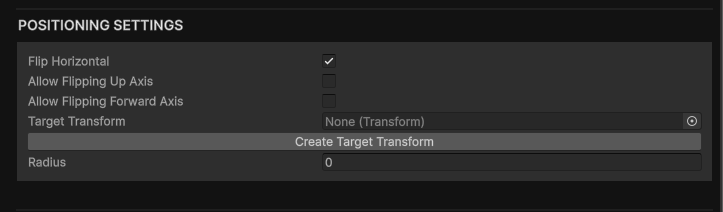

This is where the different grip types will tend to diverge. Generally they all have 3 fields:
- `Flip Horizontal` When checked, the grip will mirror over the x (red) axis per hand instead of not mirroring. 
- `Target Transform` When not assigned, the grip will reference the transform of the grip itself for grips that have specific positioning. This can be useful for grips with big trigger ranges.
- `Radius` This will offset the palm from the grip. This is also used in calculations for cylinder and sphere grips.

### Interaction Settings

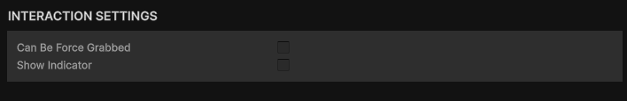

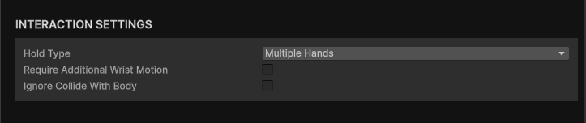

These settings are used for determining when the object should be grabbed, whether it can be forced grab, and how collision will work.

- `Can Be Force grabbed` Whether the grip will be able to be force grabbed. 
- `Show Indicator` If enabled, the grip indicator will be visible on the object.
- `Advanced - Hold Type` Specifies how a grip can be grabbed. The options are:
    - `Multiple Hands` Multiple hands can grab this grip simultaneously.
    - `Only one Hand` Only one hand can grab this grip at a time.
    - `Left Only` Only left hands can grab this grip.
    - `Right Only` Only right hands can grab this grip.
    - `Swap Grip` If the grip is currently held by another hand, then that other hand will release that grip.
- `Advanced - Require Additional Wrist Motion` If enabled, the constraints applied to the player wrists will be loosened. This is typically enabled for props like firearms.

### Advanced - Hand Joint Settings

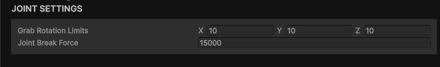

All grabbed objects are connected via joints. Currently we expose two properties of those joints:
- `Grab Rotation Limits` When grabbed, how much rotational freedom is available in each axis. Set this to zero to lock any rotational movement.
- `Joint Break Force` How much force (in newtons) it takes to break the joint. When the joint breaks you will drop the object. Increase this if you find your object is releasing too often.

### Advanced - Using Handposes

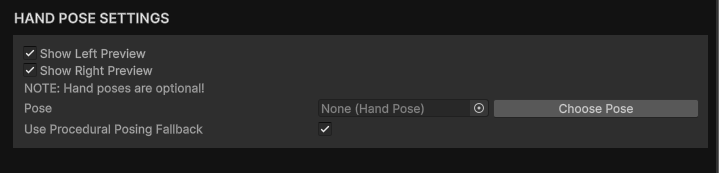

Grips have several handpose settings available. To use a handpose, click the `Choose Pose` button and pick a handpose from the window that appears. A pair of preview hands will spawn, which you can toggle on/off with the `Show Left/Right Preview` checkboxes. If you don't wish to use a handpose and instead wish to use the procedural handposing, ensure `Use Procedural Posing Fallback` is checked as well as that there is no handpose assigned. If unchecked no pose will be applied and your hands will animate as if you had an empty hand.

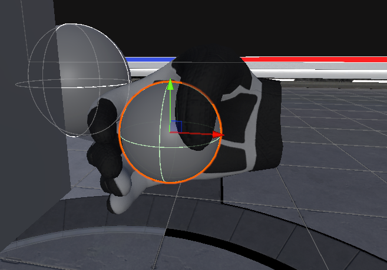

## Generic Grip

There are no specific fields to this grip. This grip just requires that there are colliders either attached to this component or as a child of this component. ALL child colliders (except triggers) will be considered when evaluating this grip.

## Point Grip

Point grips require some sort of trigger or collider to define their grab range. In NervBox we typically use a sphere trigger on the same game object as the point grip, as shown below:

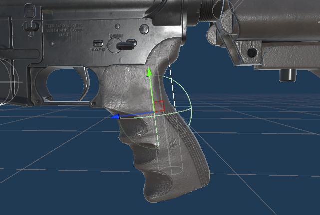

Point grips should be center aligned with their objects in order to ensure that they're symmetrical when grabbed. If you assign a target transform you can have your grip be offset from grip's transform and trigger. You'll also want to set a grip radius for thicker objects.

Point grips have a few additional fields:
- `Allow Flipping Up Axis` If enabled, the grip can be grabbed upside down on the up/y (green) axis.
- `Allow Flipping Forward Axis` If enabled, the grip can be grabbed upside down on the z/forward (blue) axis.

## Cylinder Grip

Cylinder grips require a collider or trigger to represent their grab range. In NervBox we typically use either the actual collision geometry of the object itself, or a capsule trigger. 

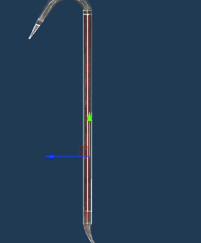

For cylinder grips, you'll want to ensure you have a non-zero `Radius` and `height` set. The height determines the length of your cylinder grip. Use the Gizmo in the scene view to preview your grip.

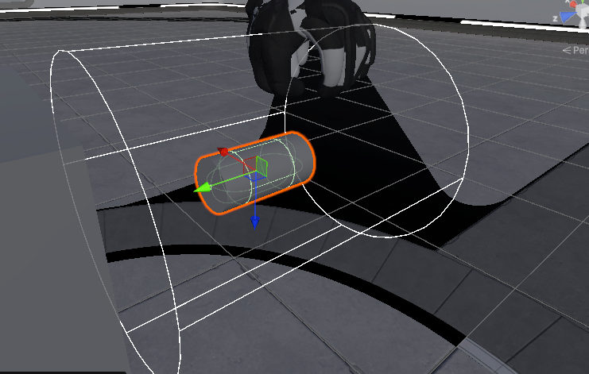

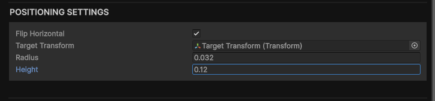

## Sphere Grip

A sphere grip also requires a trigger or collider, but behaves a little bit differently. If there is a sphere collider on/as a child of the object, the grip will use that sphere to base the grip on instead. Otherwise use the grip `Radius` field to set the sphere's radius.

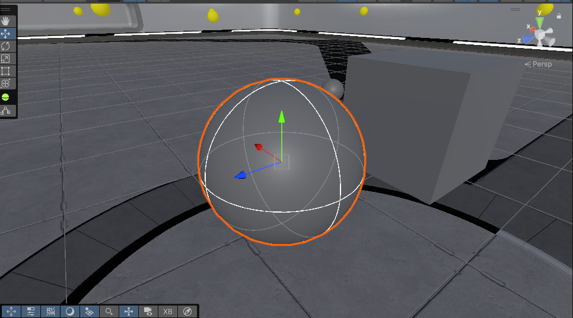

