# Making Guns

Guns in NervBox are complex, and require a lot of steps and effort. We've put together a tool to make this easier and faster.
With the Gun Wizard, you can create standard pistols, SMGs, rifles, and shotguns. Guns such as revolvers and break-action shotguns will come at later date. 
If you're unfamiliar with making spawnables with NervWare, we recommend you visit the [spawnable](/spawnable.md) page first.

## Required Prefab Setup

- A gun prefab. This should have colliders and rigidbody. A NB Impact component should also be setup. Make sure the Z forward (blue axis) matches the forward direction with the barrel.
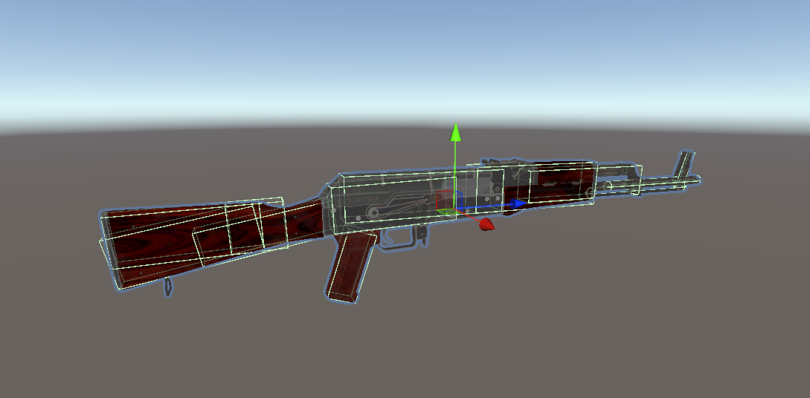
- A matching magazine prefab. This should also have colliders, a rigidbody, and an NB Impact component. 
    - 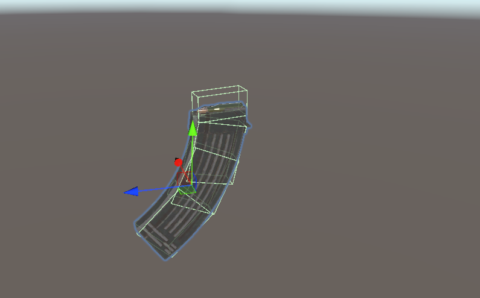

## Optional, but Recommended Prefab Setup
- A prefab for your bullet/cartridge.
    - 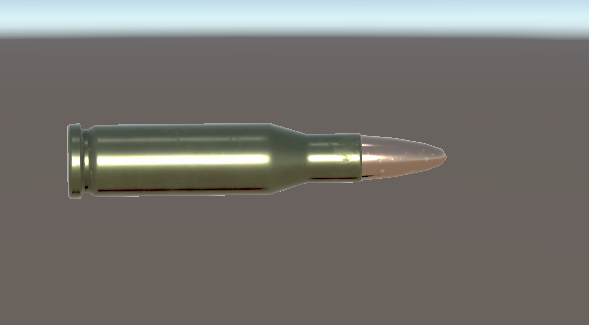
- A prefab for your bullet casing. This can be the bullet but without the tip.
- Using the above prefabs, you can have ammo state visuals. This can be done by having 3 seperate child gameObjects that represent the bullets:
    - 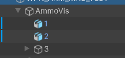
    - 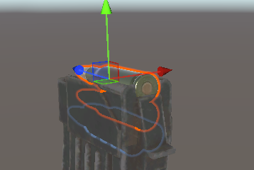
- Animations for your weapon's slide. You can either use our procedural transform movement, which will just move one part, or you can animate your weapon. You'll need to make 2-3 animations. These animations are all simple two key-frame animations, one key-frame for the beginning state, and one for the end:
    - An animation for the slide being pulled. This is where you can animate the bullet going into the chamber if desired. 
    - An animation for the slide being returned (this can be the same clip as the pulled animation).
    - An animation controller is not needed.
    
    <video controls="controls" src="./videos/slide_animation.mp4" width="600"/>

    - An animation for the slide being locked.
        - 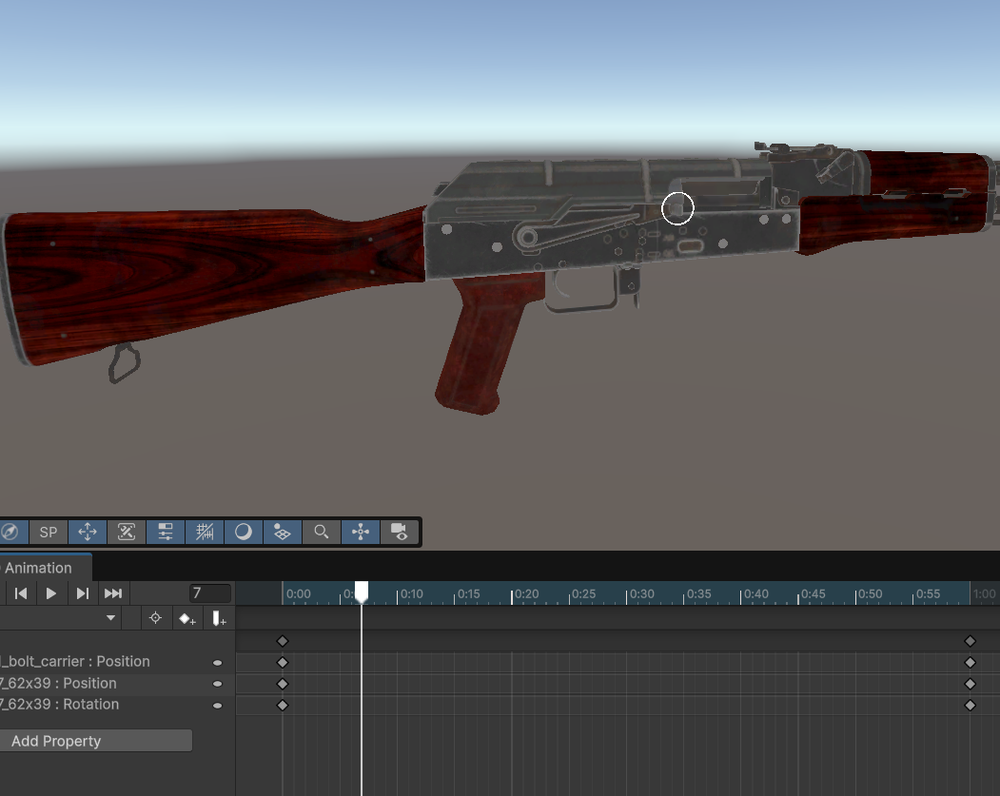

## Accessing the Gun Setup Wizard
To access the gun wizard, go to NervWare -> Gun Setup Wizard. A window will popup, and you can now begin. 

### Wizard Step 1 - Template Selection

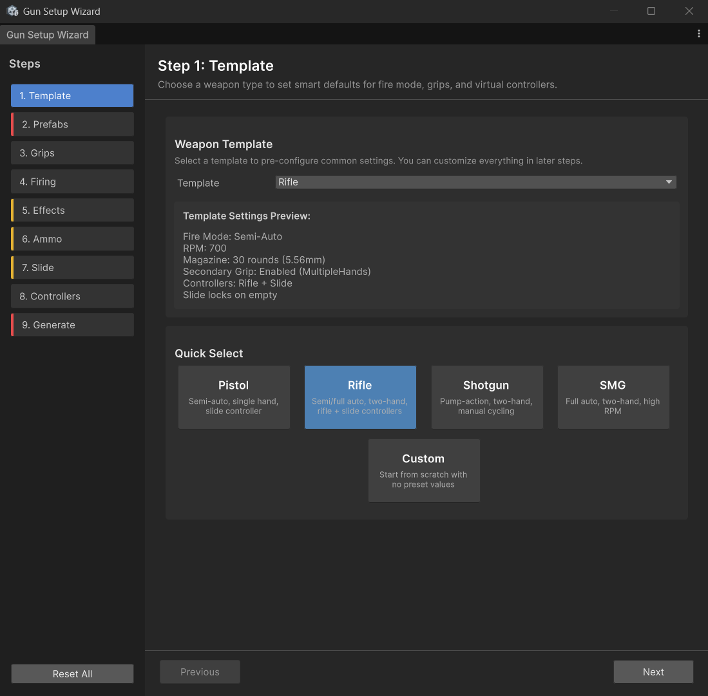

Your first step is to choose a template. This will pre-configure some settings. Choosing custom will choose no settings. For this guide, we'll choose rifle.

### Wizard Step 2 - Prefab References

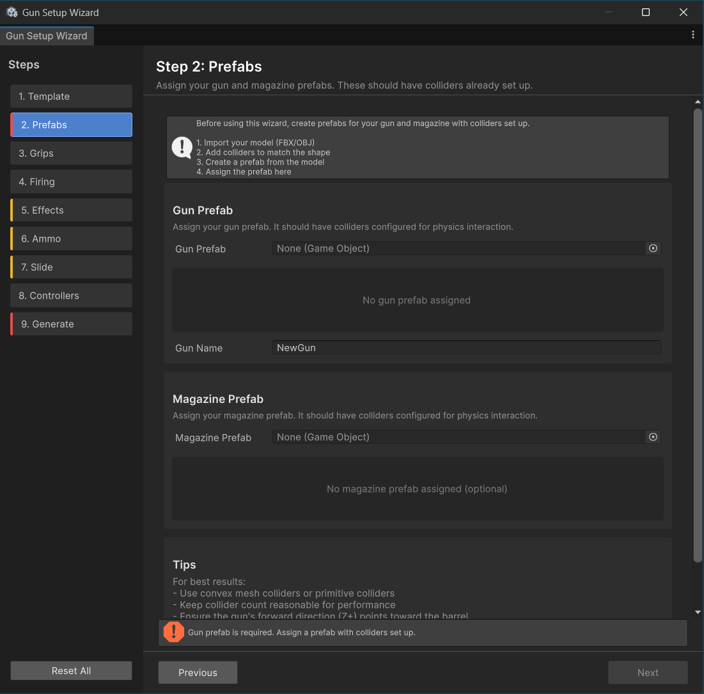

Let's assign the two gun prefabs we created earlier, and give our gun a name. The wizard will notify you if anything components on your prefab are missing. A gun will spawn in the scene view. You will be using this to assign various data.

### Wizard Step 3 - Grip Creation

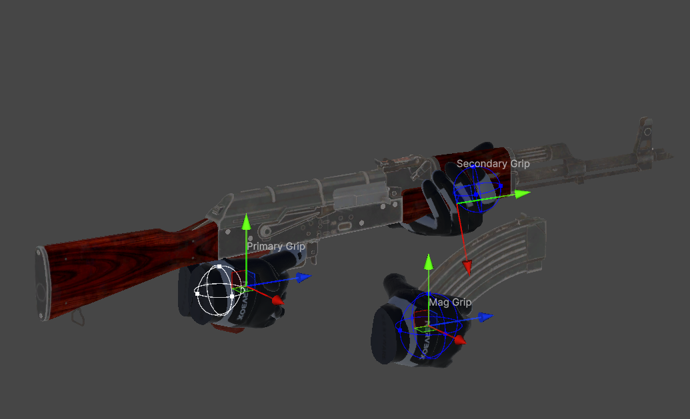

We'll now need to create grips for our weapon. You can choose a handpose to get a hand preview, then adjust with the gizmos in the scene view. The pose will automatically update to show how it'll look in game. The sphere gizmo is used to control the trigger zone for grabbing the item. You can toggle the left/right preview of each grip in the wizard.

### Wizard Step 4 - Firing Setup

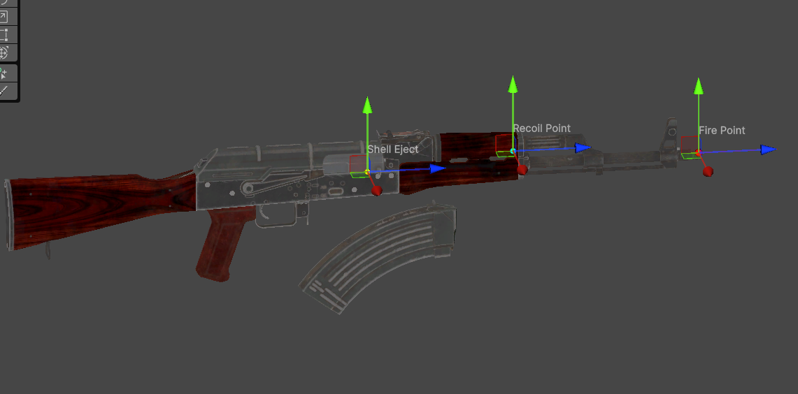

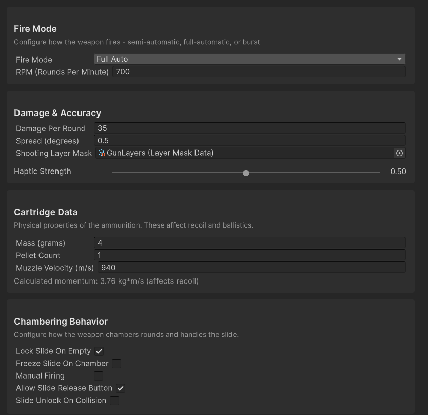

At this point you can now setup how your weapon will fire. Fire mode will determine how fast your gun shoots. Hover over a field to get a more detailed description of what a setting does. Cartridge Data is used to calculate how fast your bullets will move, as well as how much recoil your weapon will have. 

**Chambering behavior is what distinguishes a pistol from a shotgun**, hover over the checkboxes to see how they'll impact the way you use your gun.

Lastly, setup the points in the scene view. The shell eject point should be positioned slightly away from the gun, in order to prevent it from clipping with the gun.

### Wizard Step 5 - Visual Effects and Sound

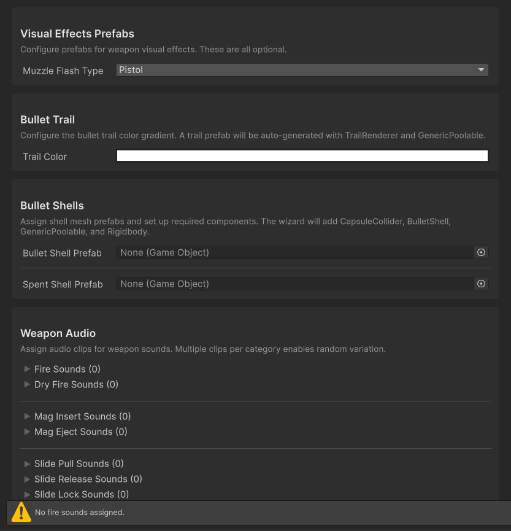

This step is optional, but is core to what makes your gun *feel* good. We recommend to at least include sounds and choose a muzzle flash. 

If you wish to use a custom muzzle flash, you'll need to make one in VFX graph, and assign it under the custom field.

### Wizard Step 6 - Ammo and Magazines

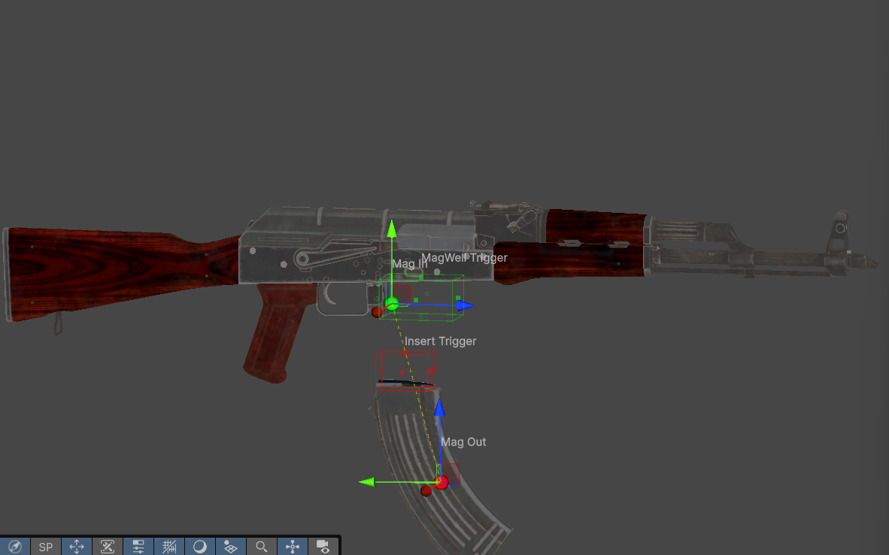

This step is for setting up how magazines interact with your weapon. There are two ammo store types:
    - Mag Well, this is your standard rifle or pistol mag insertion. 
    - Tube Fed, this is for shotguns, the inserted magazine will despawn after being inserted.

In the scene view, you can setup the trigger zones on both the magazine and the weapon itself for detection. When these two zones overlap, the magazine will be inserted.

For magazine visuals, there are two setups. You'll want to assign references to objects from the **preview in the scene view**:
    - Cartridge Based, this is for when you want to display decreasing ammo.
    - State Based, this is for when you want to display a spent version of your bullet. This is mainly for future usage in break-action shotguns or revolvers.

Magazines in NervBox are procedurally animated, and all you need to do is assign two magazine points in the scene view using the gizmos. Use the preview slider at the bottom of the wizard to view the movement. Ensure that there when ejected, the two triggers do not overlap.

### Wizard Step 7 - Slides

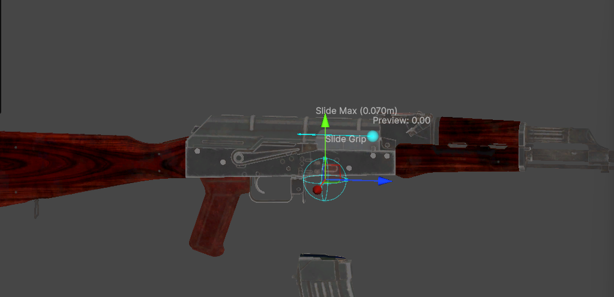

Here's where you'll use your animation clips if you created them. For the output mode, you can either use our procedural slide output, which will animate one transform, or you can use the animation clips you made. You must assign a scene view transform to represent the slide, this is what the player's hand will be attached to.  

In the scene view, note the cyan arrow. If it does not match the direction of your slide, adjust the slide direction vector to make it point in the correct direction. Additionally set the Max Distance field to make the arrow match the length of your slide. Use the slide preview in transform mode to validate these settings. 

Next setup the slide grip. This is setup in the same way as the grip step. If you wish to change the grip type or add additional grips to the slide, you can do this post generation.

Now for the shell visual, this should be a scene object that's part of your preview. If you're using the transform mode, you may want to make this a child of the slide moving object. This will get enabled or disabled based on the chamber state.

### Wizard Step 8 - Virtual Controllers

This step is required to make aiming feel good. If you used a preset, you can essentially leave this step at default settings, though you will need to set the shoulder point to be at the stock of the gun if it has one. Two haned guns should use a rifle virtual controller. Pistols should use a pistol virtual controller. A slide virtual controllers should be used on weapons that have slides, but not shotguns. 

### Wizard Step 9

This is the last step, just hit `Generate Gun`! You can now test out your weapon, or make additional tweaks in the generated prefab.  When packaging, just assign the gun prefab, and the SDK will automatically locate your magazine when building the mod.

