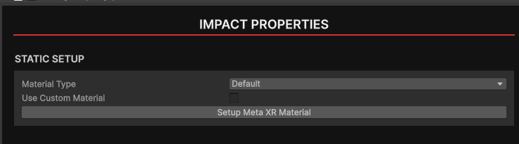
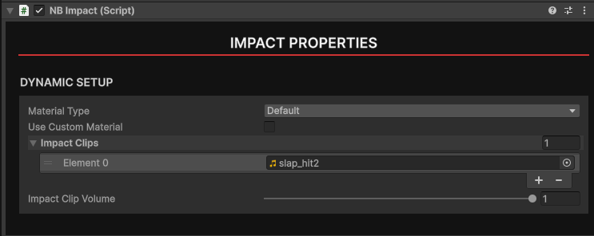
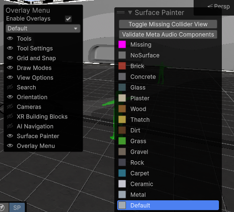
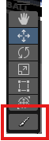
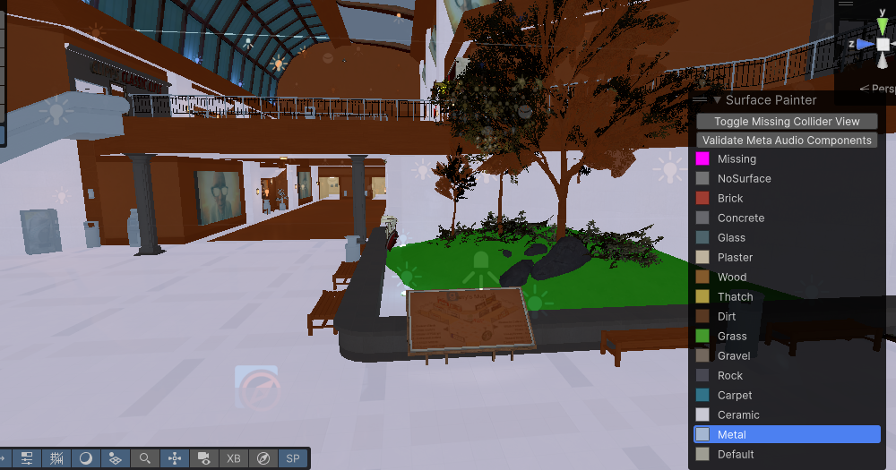
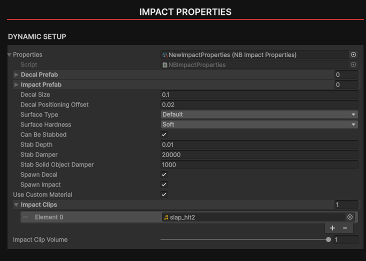
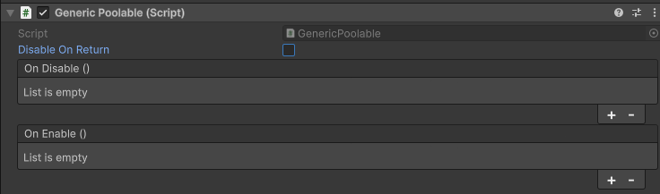

# Impact Properties and Tagging Materials

In NervBox, every surface needs to be tagged. Every surface that you wish to have sounds, bullet decals, or be stabbable, you'll need to add a NB Impact component to it. Impact components behave differently depending on whether the surface is static or dynamic.

## Material Type

The `Material Type` choosen will determine which in-game effects, sounds, and decals are used for the object. 

## Dynamic Surfaces

The `Impact Clips` field will determine which collision sounds get played on impact. If no collision sounds are present, a default sound from NervBox will be used. The volume slider will lower the levels of all clips within the `Impact Clips` array.

## Static Surfaces and Painting

A typical scene will often have many colliders and a large amount of surfaces. Each piece of static geometry should ideally be tagged with an NB Impact component, as well as with the appropriate Meta XR audio components. This can be quite time consuming, so the SDK includes a tool to tag geometry quickly, the Impact Painter.

### Impact Painter

To open the Impact Painter, click the three dots in the top-right corner of the scene view, choose `Overlay Menu`, and then click on `Surface Painter`.

Now click on the paint brush icon next to your transform toolbar. 

You are now ready to begin painting your scene with impact materials. Simply choose a material, then click on the static geometry you wish to set as that material. The surface painter will automatically add `NBImpact`, `MetaXR Acoustic Geometry`, and `MetaXR Acoustic Material` components, all with the proper fields filled out. You can click and drag to paint multiple surfaces at once. Pressing the `Toggle Missing Collider View` button will show what surfaces have or have not been tagged.  You may want to switch to unlit rendering in the scene view for better visibility. 

## Custom Materials

Custom materials are supported but we recommend using our internal materials for performance and ease of use. 
By checking the `Use Custom Material` checkbox, you can assign a custom impact properties scriptable object. To create a custom scriptable object, go to the Asset Browser, right click and choose `Create -> ScriptableObjects -> Impact Properties -> Create Data`. Give your newly created data a name and drag it into the Impact Properties component. 

### Surface Type and Hardness

This must be set on the material. The SurfaceType on the component will be ignored. Surface Hardness will be used to determine which sounds play in the event that two Impacts collide. 

### Stabbing

These properties will change with the stabbing system rework, so they can be left at their default values for now.

### Custom Decals and Impacts

Impacts in NervBox are particle systems that get played on enable/disable. Decals are just simple quads. Make a prefab for each.
For custom decals and impacts, it's important that they're pooled for performance. We have included a component in the SDK to make this easy. Once you have a prefab for each of your decals or impacts, add a `Generic Poolable` component to them. 

`Disable On Return` will ensure that the object gets disabled before returning to the pool, and will invoke the `On Disable()` event. Use this event if your effect needs some special resetting logic. You can then assign the prefabs to your custom data. 