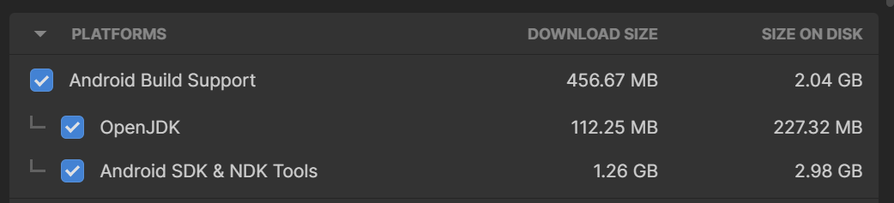
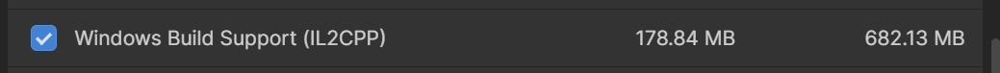
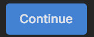
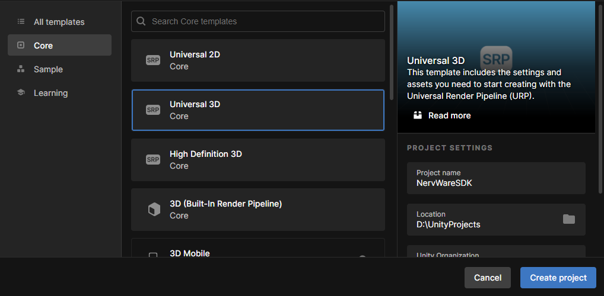
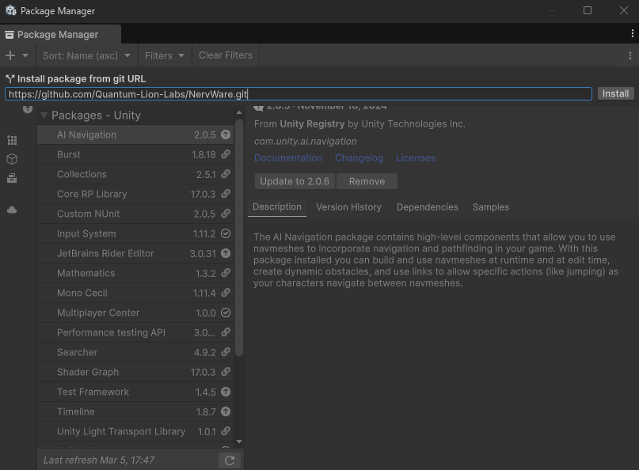
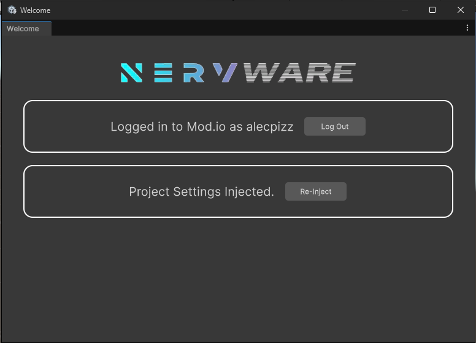
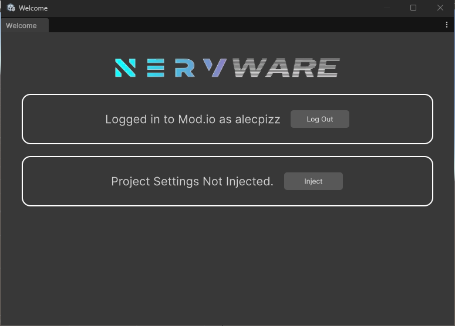
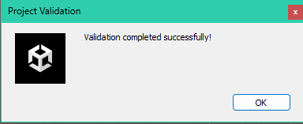
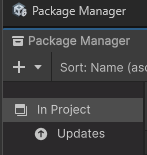
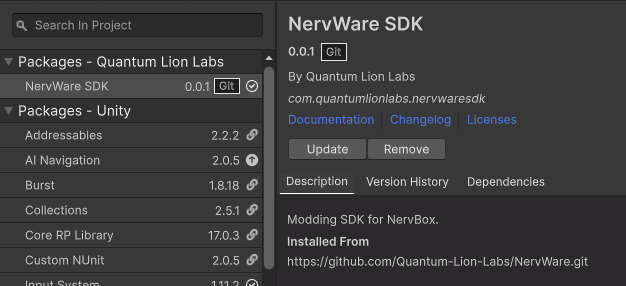

# Installation Guide

## Quickstart

* Install Unity **6000.2.0f1** + Android & Windows (IL2CPP) modules.
```
unityhub://6000.2.0f1
```
* Create a URP project. 
* Install the NervWare package via git URL. You must have **Git** installed.
```
https://github.com/Quantum-Lion-Labs/NervWare.git
```
* Log in via the Welcome Panel and Inject Project Settings (NervWare > Welcome).
* Create!

## Installing Unity

::: tip Prerequisite
You will need Git for the Unity package manager to function properly. You can download Git [here](https://git-scm.com/downloads/). Default installation settings are fine. Some systems may have this pre-installed. Restart your computer after installing Git.
:::

### You will need Unity Hub and Unity version 6000.2.0f1.

1. Install Unity Hub. You can download Unity Hub [here](https://unity.com/download).

2. Once Unity Hub is installed, open the installer for the correct editor version by pasting `unityhub://6000.2.0f1` into your browser, or by visiting Unity's [download archive](https://unity.com/releases/editor/archive).
```
unityhub://6000.2.0f1
```

3. **Make sure to include the required `Android Build Support` and `Windows Build Support (IL2CPP)` modules**. Everything else can be left unchecked.





4. Press Continue to install Unity with the required modules.




## Making the SDK Unity Project
Once Unity has finished installing, you can make your SDK project. In the `Projects` section of the Unity Hub, choose `New Project`

You can name the project whatever you'd like. You can also store the project wherever you like. The only requirements here are that you choose `Universal 3D Core` as your template project, and that the `Editor Version` is `6000.2.0f1`. This will ensure the render pipeline is setup correctly. Press `Create project` to continue.



After a small wait you should be presented with the Unity Editor. Now it is time to install the SDK.

## Adding the SDK Package

To add the SDK, go to Window > Package Manager to open the Package Manager. Click the `+` drop-down and choose `Install package from git URL...`. In that field, paste in the git URL of this repository:
```
https://github.com/Quantum-Lion-Labs/NervWare.git
```


Click `Install`. The SDK will now install. This may take a moment. A `Project Settings` window may open. You can safely close this. You will now have the **latest** version of the NervWare SDK.

## Logging in to Mod.IO
After installing the SDK package, you now need to log-in. NervBox mods are hosted on Mod.IO. An account is required to do so. Luckily this is easy to do through the welcome panel.

To log in:

From the welcome panel (if it is not visible go to the menu bar, choose NervWare > Welcome) enter the email that you wish to use for Mod.IO and click `Request Auth Code`. A code will be sent to your email, which you can then paste into the field to login. You will then be signed into the NervWare SDK.



## Project Settings Injection
Following log-in, the SDK needs to have some settings adjusted to match NervBox's. Open up the welcome panel again. Then click the `Inject` button next to `Project Settings Not Injected` to validate the project settings. This may take a moment.



Upon completion you will see a pop-up letting you know it validated successfully!



**You now need to restart your project to fully initialize the SDK. A prompt will appear allowing you to automatically do so.**

If you ever change a setting, and your mods are no longer behaving how you expect them to, you can always re-inject the project settings using the same button.

## What's Next
Congrats! You have now installed the NervWare SDK. You can now begin [creating your first spawnable.](/spawnable.md)

## FOR FUTURE SDK UPDATES - Updating the SDK
If your SDK is out of date, you can update it through the Unity Package Manager.

Go to Window > Package Manager. Select the `In Project Category`



There will be a Quantum Lion Labs sub-category. Click the `Update` button to check for SDK updates and update your project.

