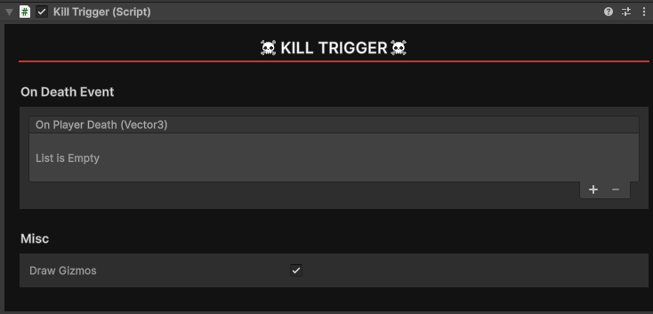

# Kill Trigger

The `Kill Trigger` component is a simple damage field for keeping players within levels. To use it, attach the component to a box collider marked as a trigger. There is a synced `On Player Death` event that can also be assigned.