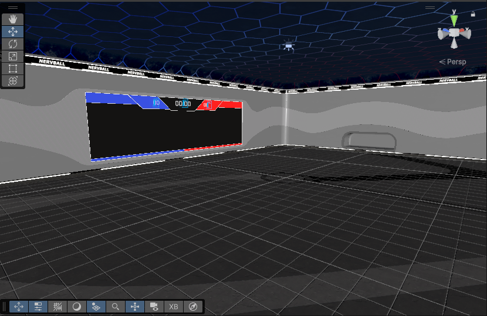
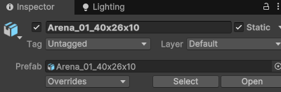
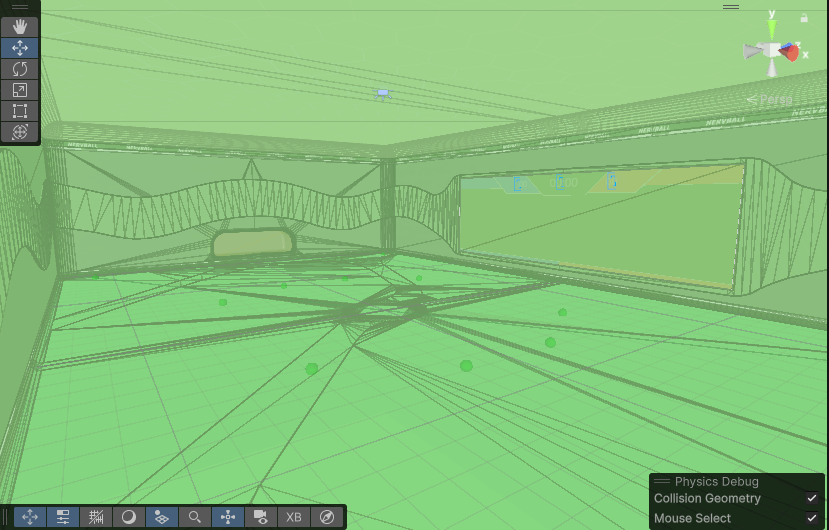
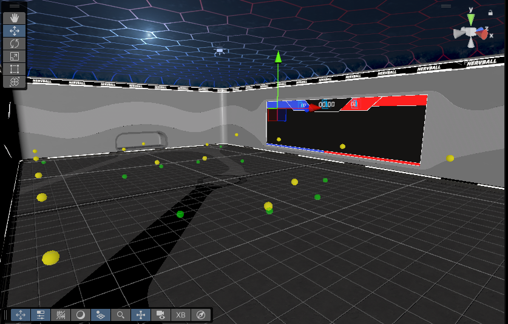
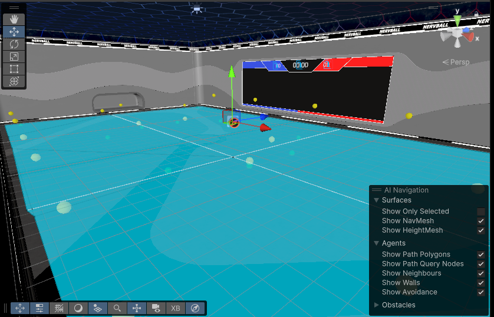
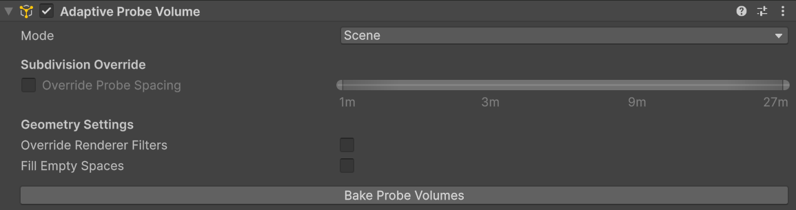

# Creating your first level
In NervBox, we have several steps to setup our levels, in order to ensure a high level of detail and performance. Level design and modeling are outside of the scope of this guide. We'll assume at this point that you have your level geometry setup at this point. This guide will be using an empty version of the NervBall arena:

## Gamemode Info
In order for players to:
- Spawn in
- Choose a game mode
- Have game mode specific items

You'll need to provide the level with `Gamemode Info`. To do this, Create an empty game object, name it whatever you'd like, and add a `Gamemode Info` component to it. 

Within Gamemode Info, click the `Add Spawn Point` button. A representation of the player will appear in the world. Use the handle to place your spawn point. You can add as many spawn points as you'd like. In-game they will be randomly selected from. 

Your Gamemode Info is now setup.

## Static Geometry and Occlusion Culling
In order for the best performance, objects in your level that do not move should be marked as static. GameObjects can be marked as static by checking the `Static` field at the top of the inspector when selecting a GameObject. 

Once your level has been marked as static, you can now bake occlusion culling, which will help with performance on large scenes. To do this, go to Window->Rendering->Occlusion Culling, which will open the Occlusion tab. Click `Bake` to bake occlusion. This should be pretty quick.

**TODO: Occlusion culling best practices**

## Physics
NervBox is physics based, so each scene will need collision. Generally for static objects you can use a non-convex `Mesh collider`, but if you're noticing that objects are falling through walls or floors, consider adding some thicker box colliders to help catch them. Non-Convex mesh colliders are paper thin. You'll need to add colliders to all objects that you want to be able to interact with. For each collider, you should assign a physics material to represent the friction and bounciness of the surface. In NervBox we typically use real world values, such as 0.9 static and dynamic for concrete. 

If you have dynamic props or rigidbodies in the scene, you'll need to add `NetworkedInteractables` to them so they sync properly. See [creating a simple spawnable](https://github.com/Quantum-Lion-Labs/NervWare/wiki/Creating-a-Simple-Spawnable) for more information. Dynamic props should use primitive colliders unless a mesh collider is more optimal.

**TODO: Level Collision best practices**

Our scene now has collision!

## NBImpact

It is also required that you tag your scene geometry for material properties. For each static geometry in your scene that you wish to have sounds, bullet decals, or be able to be stabbed, you'll need to add a NB Impact component to that object. The SDK includes a tool to paint geometry quickly. To open this tool, click the three dots in the top-right corner of the scene view, choose `Overlay Menu`, then click on `Surface Painter`.

Now click on the paint brush icon next to your transform toolbar. 

You are now ready to begin painting your scene with impact materials. Simply choose a material, then click on the static geometry you wish to set as that material. You can click the `Toggle Missing Collider View` button to show what surfaces have or have not been tagged. The surface painter will automatically add `NBImpact`, `MetaXR Acoustic Geometry`, and `MetaXR Acoustic Material` components, all with the proper fields filled out. You may want to switch to unlit rendering in the scene view for better visibility. 

## Audio
NervBox uses Meta's Acoustics SDK to provide ray-traced audio. To make this work our scene needs to be baked for audio. To do this the scene will need to have `MetaXR Acoustic Materials` and `MetaXR Acoustic Geometries` on all static geometry. If you used the painter tool, this is already done for you. 

For each static object with collision in your scene:
- Add a Meta XR Acoustic Material component to the game object.
- Assign an Acoustic Material Properties scriptable object (provided in the SDK).
- Add a Meta XR Acoustic Geometry component to the game object.

Once your scene geometry has been appropriately tagged, create a GameObject, name it `Acoustic Map` or whatever you'd like, then add a `Meta XR Acoustic Map` component to it. Open up `Mapping Configuration`, then click `Map Scene` to automatically place audio probes. It is recommended to click `Prune Scene` after to clean up any probes that are out of bounds. Finally, click `Bake Acoustics` to build the acoustic geometry, and acoustic map. This may take a few minutes. Your scene will now be baked for audio! This will create several files in your scene's folder, do not move or change them, or you may encounter errors or unexpected behavior.

The yellow spheres are audio probes.

## NavMesh

For NPCs to be able to navigate within the scene, each level needs to have navigation meshes baked. You'll need to create `NavMesh Surfaces` to do this. To create a navmesh for the entire scene, create an empty game object, and add a `NavMesh Surface` component. Click `Bake` to generate a NavMesh. To preview your navmesh, click the 3 dots in the upper-right corner of the scene view and choose `Overlay Menu`. From there tick on the `AI Navigation` menu. Click `Show NavMesh` to view your navmesh.

## Lighting
NervBox uses baked lighting in order to achieve high fidelity visuals and good performance. Baked lighting is tricky, so have some patience! 

### Adaptive Probe Volume (APV) Setup
For dynamic objects to be lit properly, you will need light probes. NervBox uses Unity 6's new Adaptive Probe Volumes as they are simple to use and performant.

The easiest setup for APVs is to add the component to a gameobject, and to set their mode to "Scene".
They will be baked along with lightmaps and reflection probes when baking the scene.

### Reflection Probes
Reflection Probes are vital in Unity for creating realistic reflections, capturing a spherical view of their surroundings and storing it as a Cubemap. To place one, navigate to the Unity editor menu and select GameObject > Light > Reflection Probe.

Once placed, adjust the probe's position and its "Size" property to define the influence volume where its reflections will be applied. You can refine this bounding box using the Inspector. For optimal results, position probes in areas where reflections would noticeably change, such as room centers or near large reflective objects. Remember to "Bake" the probe for static reflections; for dynamic objects, set the "Type" to "Realtime," keeping performance in mind.

### Lightmaps
Once you've set up your Light and Reflection Probes, it's time to bake them, and your lightmaps. Default settings should be fine, just make sure to keep the lightmap resolution at a level that allows for baking down to 1 4k texture.