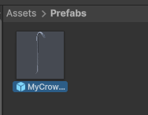
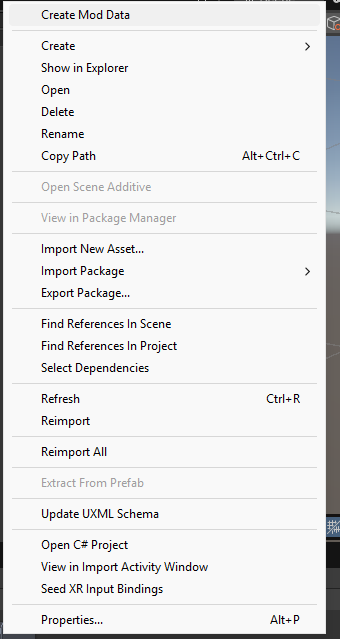
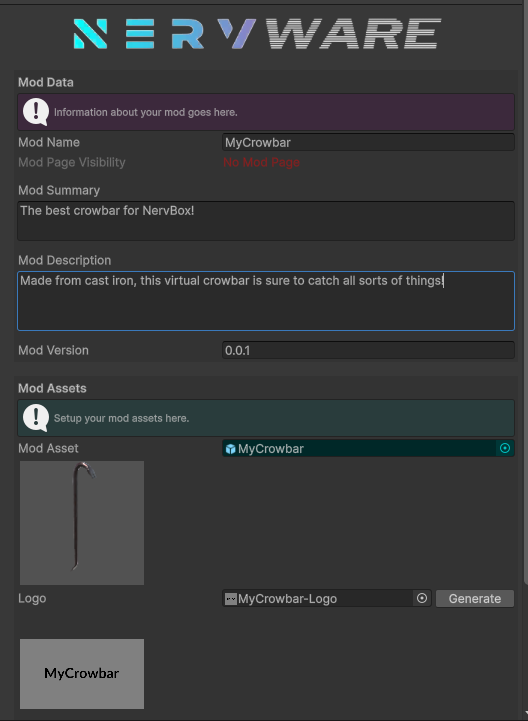
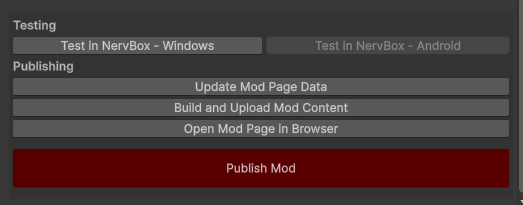

# Packaging your Mod
You are now ready to start packaging your Spawnable or level.

For Spawnables, you must make a prefab of your Spawnable. To do this, create a folder within your project called `Prefabs`. Next, drag your spawnable GameObject from the hierarchy into the `Prefabs` folder. This will create a prefab.

Now that you have your prefab or scene asset, right click on it in the Asset Browser and choose `Create Mod Data`. A mod data scriptable object will be created. These mod data scriptable objects will always be created next to your mod asset. They contain information about your mod and store persistent data so that you can update your mod if needed.
 

Within this data you can fill out information about your mod for uploading. Under Mod Assets, you must assign a logo for your mod. Use the `Thumbnail Creator` button to open the Thumbnail Creator window. See the [thumbnail creator page](/thumbnail.md) for more information.

Once you have your mod information setup, you can create the mod page by clicking `Create Mod Page`. This will create a mod page on Mod.IO which you can view by clicking the new `Open Mod Page in Browser` button. You'll now need to build your mod by clicking the `Build and Upload Mod Content` button. The time this takes can vary depending on the size of your mod. Spawnables should generally be smaller and quicker to build and upload, while levels can take longer, especially when compiling shaders. All uploaded mods will not be published by default. You will need to test your mod in-game before publishing. See the [mod testing page](/testing.md) for more details. The visibility of your mod can be seen at the top of your mod data or on Mod.IO. 

## Publishing your mod
After your mod has been packaged, given appropriate information, and uploaded, you can finally publish it on Mod.IO. To publish a mod, click the `Publish Mod` button. Your mod will now be public for everyone to enjoy! For future updates of your mod, you will need to re-build and re-upload, but the data can stay the same, and the mod will continue to be public.

