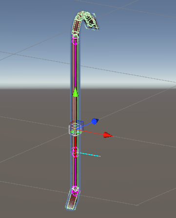

# Holstering/Slottable Object
If you want your object to be able to be holstered, add a Slottable Object component to its root. All references must be filled out: 
- A primary grip must be assigned, this will be the grip that is required to be held before slotting.
- A start and end point must be defined as child objects of the slottable, in order to assist with positioning and rotating your object relative to the player's holster. You can click the `Add start and end points ` button to create them, but they must be positioned in the editor. The start and end points should line up with the long axis of your spawnable. For example, with a spear, you would put them on either end. 
- The `Secondary Axis` field of the component should be perpendicular to your main axis. See the gizmos in the scene view to see how it aligns.

