# Creating your first spawnable

## Setting up a synced object
Acquire or make a model. Typically models used in NervBox are under 20k triangles. In this example we'll be making a crowbar.

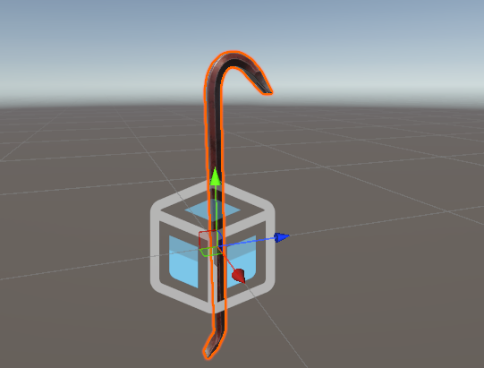

Create an empty GameObject, and name it whatever you want your spawnable name to be. This will be your spawnable root. Drag your model in as a child of this GameObject. This is done to allow you to scale your art without having to scale the root of the spawnable.

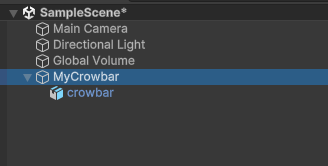

Beneath your spawnable root, create a new GameObject. Name it `Colliders`. Beneath this GameObject, create and add colliders for your model. We recommend using primitive colliders whenever possible, and avoiding mesh colliders with too many tris. The hierarchy of the individual colliders can be setup however you like.

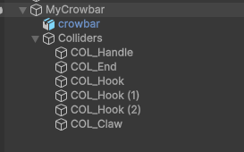

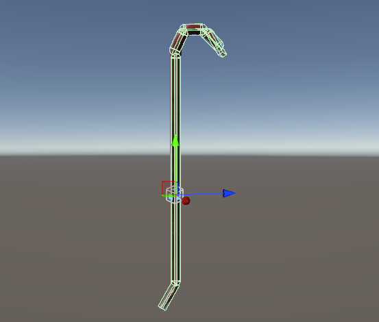

Now that you have your model setup with colliders, it is time to add a rigidbody to make it have physical. Click on your spawnable root, then in the inspector choose Add Component -> Rigidbody. A rigidbody component will be added. Now you need to set the mass of your object in kilograms. In NervBox we typically use real-world masses for our spawnables, so it is a good practice to reference the real world version of your spawnable. Leave Interpolate to None and Collision Detection to Discrete unless you find that your spawnable is falling through the world in-game.

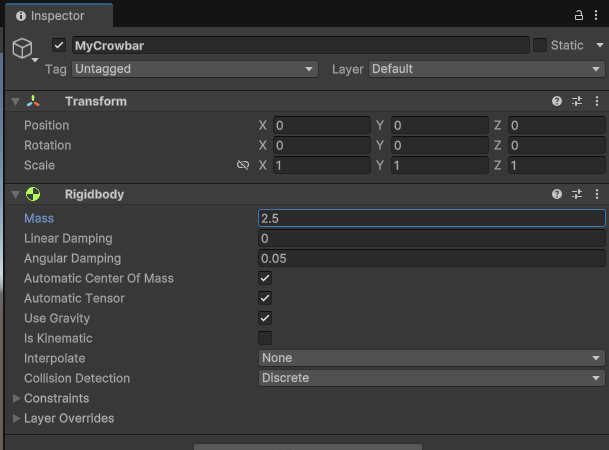

You now have a physics object, but it still needs to be synced over the network. To do this, add a Networked Interactable component to the spawnable root. If there are any child rigidbodies, add a Networked Interactable to each of those as well. Your object won't work properly without this!

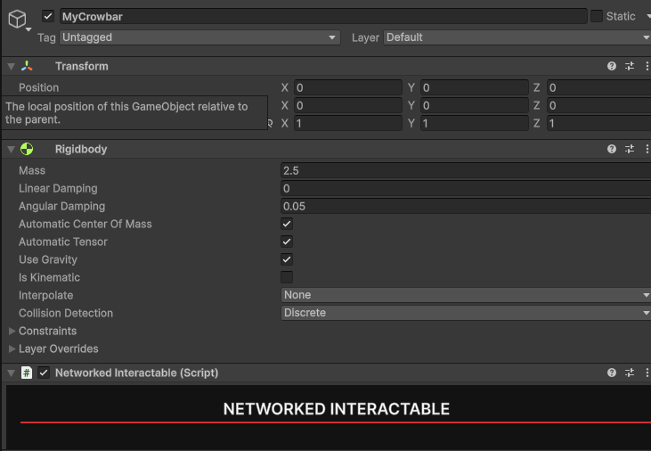

## Grips
For this simple prop, we'll use a `Generic Grip`. A `Generic Grip` can be grabbed from any location, at any orientation. Generic grips use procedural hand poses. For more information about `Generic Grips` or other grips, see the [grips page](/grips).

To use a `Generic Grip`, add the component to either your Spawnable Root or specific colliders that you wish to be grabbable. In this example we'll add a generic grip to the handle of the crowbar.

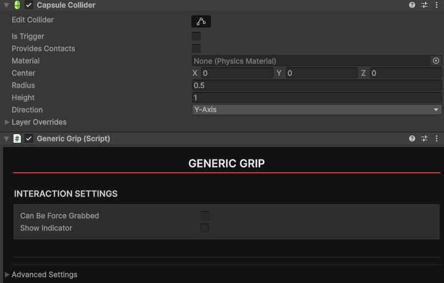

## Other Components
### NBImpact 
**Recommended** For your object to have impact sounds, take bullet hits, and be able to be stabbed, it needs to be tagged with NervBox's material system. To do this, add a NB Impact component to your spawnable root. From there to use NervBox's materials, simply choose a material type. If you'd like to make your own material, check the `Use Custom Material` property. For custom collision sounds, you'll also need to provide audio clips in the `Impact Clips` array.

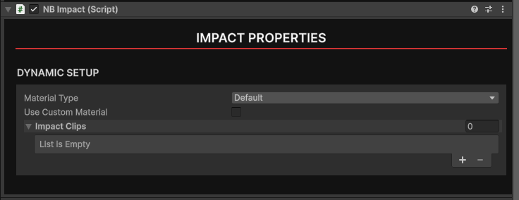

### NB Collision Sender
If you want you object to deal damage when hitting an enemy or player, add a NB Collision Sender component. Within the component set your hit impact multiplier to determine how strong your object is. Typically a value between 0.5 to 5 is good.

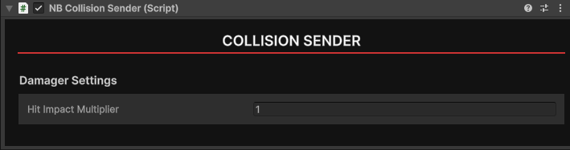

### Holstering/Slottable Object
If you want your object to be able to be holstered, add a Slottable Object component to the spawnable root. All references must be filled out: A primary grip must be assigned, this will be the grip that is required to be held before slotting. A start and end point must be defined as child objects of the slottable, in order to assist with positioning and rotating your object relative to the player's holster. You can click the `Add start and end points ` button to create them, but they must be positioned in the editor. The start and end points should line up with the long axis of your spawnable. For example, with a spear, you would put them on either end. The `Secondary Axis` field of the component should be perpendicular to your main axis. See the gizmos in the scene view to see how it aligns.

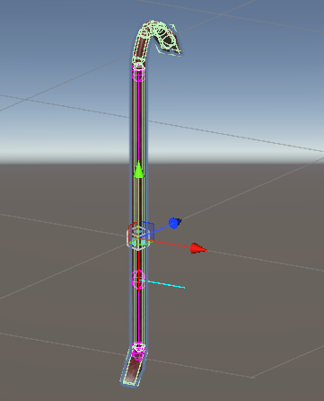

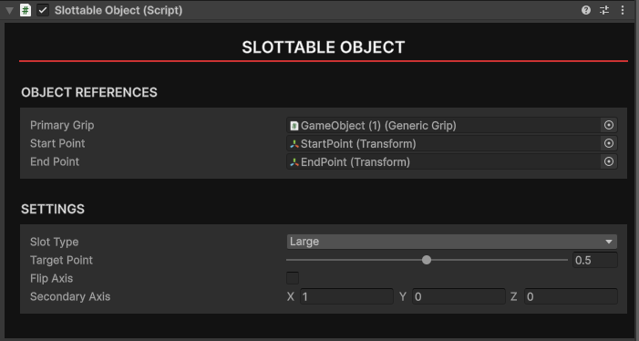

## Packaging your Spawnable
You are now ready to start packaging your Spawnable. To do this, create a folder within your project called `Prefabs`. Next, drag your spawnable GameObject from the hierarchy into the `Prefabs` folder. This will create a prefab.

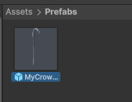

Now that you have your spawnable prefab, right click on it in the Asset Browser and choose `Create Mod Data`. A mod data scriptable object will be created. These mod data scriptable objects will always be created in the root of the project. They contain information about your mod and store persistent data so that you can update your mod if needed.
 
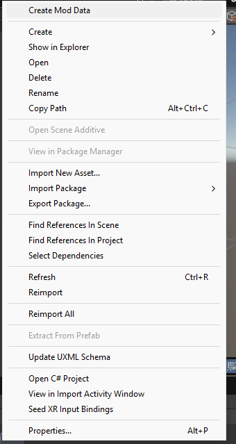

Within this data you can fill out information about your mod for uploading. Under Mod Assets, you must assign a logo for your mod. Use the `Thumbnail Creator` button to open the Thumbnail Creator window. See the [thumbnail creator page](/thumbnail.md) for more information.

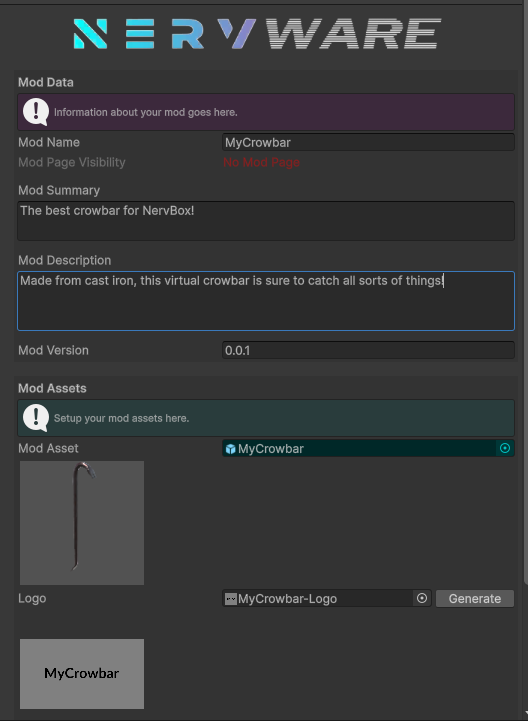

Once you have your mod information setup, you can create the mod page by clicking `Create Mod Page`. This will create a mod page on Mod.IO which you can view by clicking the new `Open Mod Page in Browser` button. You'll now need to build your mod by clicking the `Build and Upload Mod Content` button. The time this takes can vary depending on the size of your mod. Spawnables should generally be smaller and quicker to build and upload. All uploaded mods will not be published by default. You will need to test your mod in-game before publishing. The visibility of your mod can be seen at the top of your mod data or on Mod.IO. 

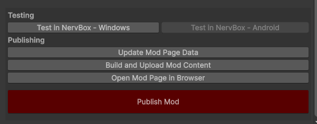

## Publishing your mod
After your mod has been packaged, given appropriate information, and uploaded, you can finally publish it on Mod.IO. To publish a mod, click the `Publish Mod` button. Your mod will now be public for everyone to enjoy! For future updates of your mod, you will need to re-build and re-upload, but the data can stay the same, and the mod will continue to be public.

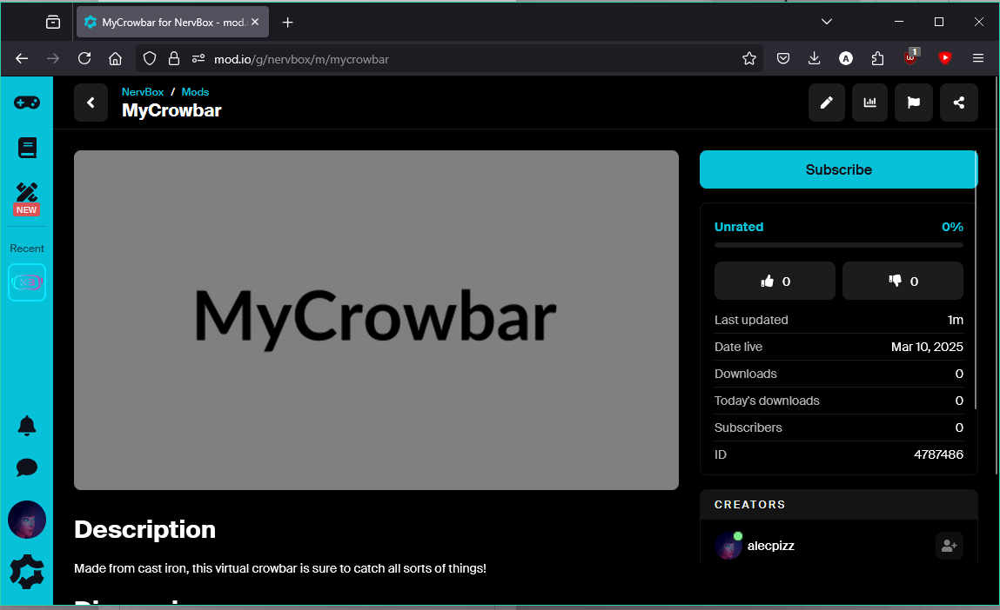
