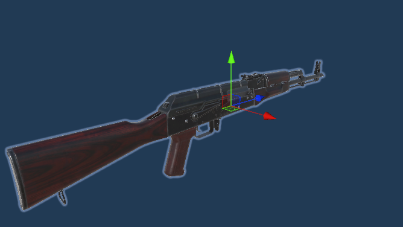

# Spawnable Best Practices

Tips for making your spawnable the best it can be.

## Orientation and Pivots

Try to have your pivot point zero'd out such that there is not a large distance between the main part of your spawnable and the object's root. Large pivot distances can cause physics explosions.

For orientation, try to ensure the axis's of your root object match up with how your object is designed. For example, a rifle should have its forward axis (blue) aligned with the barrel of the weapon, it's up axis (green) facing towards the sky, and it's right axis (red) facing away from the weapon. 

## LODs

For performance, LODs are recommended for your spawnables. With Unity 6.2 you now have access to MeshLODs, which will do this automatically. To enable this, select your model, choose the 'Model' tab on the import settings panel, and tick 'Generate Mesh LODs'. See the Unity [docs](https://docs.unity3d.com/6000.2/Documentation/Manual/lod/mesh-lod-introduction.html) for more information.
