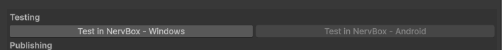

::: danger QUEST TESTING WORKFLOW IS CURRENTLY UNAVALIABLE
Quest modders will need to test on PC currently, or upload a **non-published** mod to Mod.IO for testing.  
:::

# Testing your Mod

To test your mod you must have NervBox on Steam and have it installed. Mods must be moved to the testing directory to be detected by the game. To do this, click the `Test in NervBox - Windows/Android` button with your desired platform.



This will build (if needed) and move the mod into the following directory on Windows:

```
Application.PersistentDataPath/Quantum Lion Labs/NervBox/Test Mods/
```
Where `Application.PersistentDataPath` is your `user AppData/LocalLow`. 

You can now head in-game to test.

# In-Game

To begin a test mod session, head to the settings panel of the main menu. Then click on Mods, followed by start test session. This process is required for all mods. You will spawn in an empty world, where you can use the Sandbox Gun to spawn in your spawnable mods. For maps, click on the worlds tab of the in-game menu, and then choose the level you created.