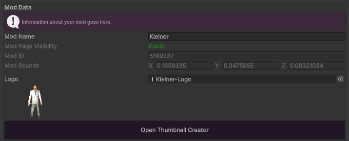
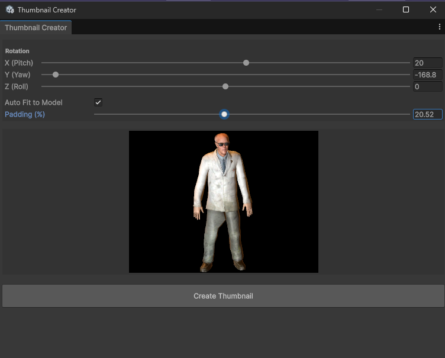
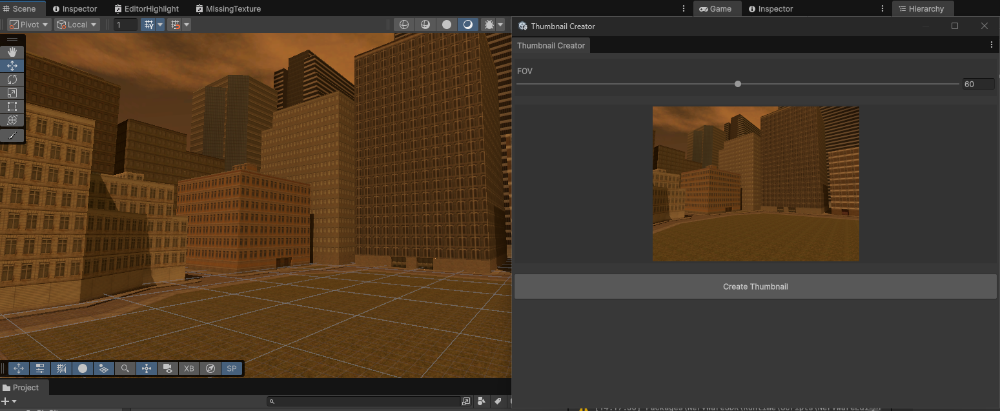

# Thumbnail Creator

The thumbnail creator allows you to easily create high quality logos for your mods that match the style of the in-game spawn menu. The thumbnail creator works for both levels and spawnables. To use the creator, ensure you have a spawnable setup with a mod data asset, then click on the `Open Thumbnail Creator` button. A window will appear.

## Making a Spawnable Thumbnail

For Spawnable prefabs, you'll want to try and align the top and bottom of the model with the top and bottom of the frame. This way the thumbnail will appear properly sized within the spawn menu. Try to include the entire model in the frame if possible.

Click 'Create Thumbnail' to save your image.

## Making a Level Thumbnail

For levels, you'll want to bring out your inner photographer. Level thumbnails will use the scene view camera. Simply move in scene view to adjust your image. Try to capture your scene in an interesting way that shows the main parts of your level. 

Click 'Create Thumbnail' to save your image.