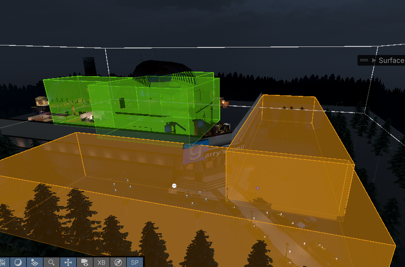
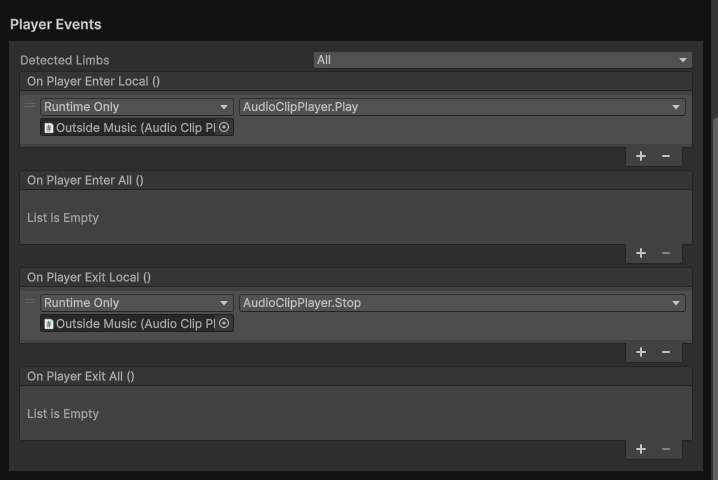

# Trigger Events

## About Trigger Events
`Trigger Events` are a great method of adding simple logic to custom maps. The component will provide access to Unity life-cycle events, local player entering and exiting, as well as as a synced event.

## Using the Trigger Events Component

A `Trigger Events` component must have a trigger collider on its object, and can have additional trigger colliders as children of it. Box colliders are recommended for this. 

You can now assign Unity Events to define your behavior.

## Example: Changing Level Ambience for Different Areas

In this example we've added a trigger that surrounds the outside of our environment, and a trigger that ecompases the inside of it. The outside `Trigger Events` component is setup like this: 

Here we're ensuring players that are within the outside trigger are hearing the outside music that should play. Once they exit that trigger by entering the structure, they will stop hearing the outside ambient music.